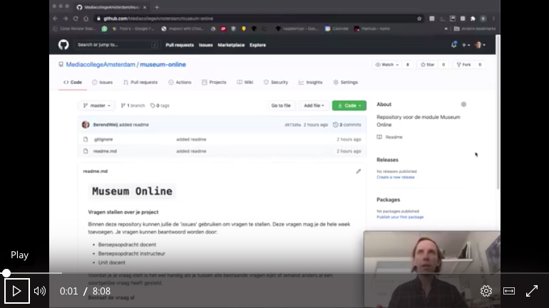

# Hoe stel ik een vraag?
Op deze pagina staan de instructies over hoe je een vraag kunt stellen voor de beroepsopdracht Museum Online.
Deze vragen leveren jullie aan via GitHub.   
Je vragen zullen beantwoord worden door 1 van de volgende personen;

- Beroepsopdracht docent
- Beroepsopdracht instructeur
- Unit docent

## Voordat je een vraagt aanmaakt
Beantwoord voor jezelf de volgende vragen voordat je een vraag post bij de issues;
- Bestaat de vraag al?
- Staat er al een antwoord bij?

## Nieuwe vraag aanmaken
Als je geen vraag ziet wat over jouw probleem gaat dan doe je het volgende;  
1. Ga naar de issues pagina: [Link naar GIT Issues](https://github.com/MediacollegeAmsterdam/museum-online/issues)  
2. Maak een nieuwe issue aan
3. Zorg dat je maar 1 probleem per issue aanmaakt
4. Hou de titel kort en duidelijk, bijvoorbeeld "Klikken op 3D model in Unity werkt niet"
5. Omschrijf duidelijk wat je wilt bereiken
6. Omschrijf duidelijk waar je tegenaan loopt
7. Omschrijf wat je al geprobeerd hebt
8. Post de error erbij die je krijgt
9. Post een screenshot/gif erbij wat duidelijk het probleem laat zien [GIPHY](https://giphy.com/)
10. Post de code erbij die je hebt geschreven
11. Hang een label aan je issue.

## Tutorial "hoe stel ik een vraag"
De bovenstaande instructies kun je ook terugbekijken in onderstaande video tutorial:

